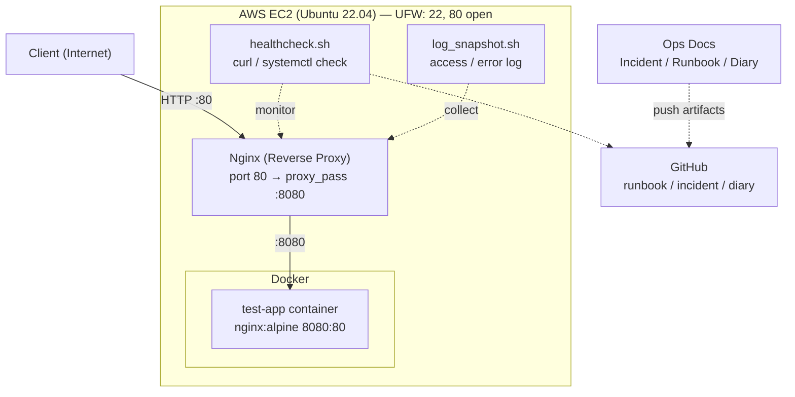

# Ops Mini Platform (12주)

시스템엔지니어 취업 포트폴리오를 목표로 한 12주 운영형 인프라 프로젝트입니다.

단순 구축이 아니라 운영(Runbook) + 장애대응(Incident) + 재현성(IaC) 을 증명하는 것을 목표로 합니다.

## 목표

- 리눅스 서버 운영/점검/복구 능력 강화

- 의도적 장애 재현 → 원인 분석 → 복구 → 재발 방지 문서화

- Terraform 기반 재현 가능한 인프라(IaC) 구축

## 현재 진행 상황

- Day1: EC2 접속 및 Nginx 실행 확인, `curl -I http://localhost` → 200 OK
- Day2: 외부(Public IP) HTTP 접근 확인, UFW로 80 차단/복구 재현, 첫 Incident 문서 작성
- Day3: `healthcheck.sh` 작성 nginx active / localhost HTTP 응답 / port 80 listening 자동 확인 시작
- Day4-5: Nginx 설정 백업 및 `nginx -t` 검증 절차 고정, 문법 오류 재현/복구 수행, SSH 보안 설정 1차 적용 및 안전 재접속 절차 문서화
- Day6: `healthcheck.sh` 업그레이드, `log_snapshot.sh` 작성, `/app/` reverse proxy 설정으로 502 재현 및 증거 수집, incident 문서화
- Day7: Runbook 목차 정리, Week1 회고 작성, 기존 incident 재리허설
- Day8: Docker Engine 설치, `docker version`/`docker ps` 검증, Docker 서비스 stop/start 장애 재현 및 복구
- Day9: 테스트 앱 컨테이너 실행, 포트 매핑 8080:8080 오류 재현 후 8080:80으로 수정하여 복구
- Day10: Nginx `/app` reverse proxy를 Docker 앱(`127.0.0.1:8080`)에 연결하고, upstream 포트 오타로 `502 Bad Gateway`를 재현한 뒤 `error.log` 확인 후 복구
- Day11: deploy.md + rollback.md 작성, nginx reload 누락으로 인한 배포 미반영 재현 및 복구 (INC-007)
- Day12: 로그 구조 정리, log_snapshot.sh에 docker logs 항목 추가, container 없이 로그 실패 및 복구(INC-008)
- Day13: docker-compose.yml 작성, docker run 기반 실행을 compose로 전환, 포트 오타 재현 및 복구 (INC-009)
- Day14: README/index.md 업데이트, INC-005 재리허설, Week2 회고 작성
- Day15: incidents 형식 업그레이드 및 획일화, `decisions/0003-incident-severity-sla.md` 작성
- Day16: `runbook/security-baseline.md` 작성, UFW 비활성화 장애 재현 및 복구
- Day17: `chmod 777` 위험 권한 재현 → `644` 복구, INC-009 작성
- Day18: nginx 보안 헤더 적용(`X-Content-Type-Options` 등), `decisions/0004` 작성
- Day19: `scripts/security-baseline.sh` 작성 (SSH/UFW/권한/포트/스캐너 IP 점검 자동화)
- Day20: Docker Compose 멀티 컨테이너 구조 전환, nginx 컨테이너 + app 컨테이너 분리, 502 재현 및 복구
- Day21: Week 3 회고, README 업데이트, `security-baseline.sh` 최종 실행 결과 캡처
## 레포 구조

- `runbook/` : 운영 절차(접속/배포/점검/복구)
- `incidents/` : 장애 기록(증상, 원인, 복구, 재발 방지)
- `evidence/` : 검증 결과 및 스크린샷/출력 캡처
- `decisions/` : 의사결정 기록(왜 이렇게 설계했는지)
- `diary/` : 일일 기록(진행 로그)

## Architecture

- EC2 위에 Nginx가 리버스 프록시로 동작하며, 
- Docker 컨테이너(test-app)로 트래픽을 전달합니다.
- healthcheck.sh와 log_snapshot.sh로 상태를 모니터링하고,
- 모든 운영 산출물은 GitHub에 기록합니다.

