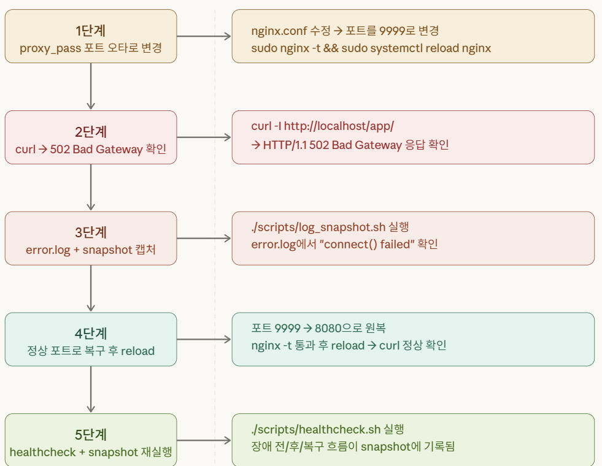

# Day6 — 로그 스냅샷 도구와 502 장애 재현

## 목표

장애 발생 시 시스템 상태와 nginx 로그를 한 번에 수집할 수 있는 스크립트를 만들고, reverse proxy 설정 오류로 502 Bad Gateway를 재현한 뒤 복구 흐름을 연습한다.

## 오늘 한 일

- 기존 `healthcheck.sh`를 업그레이드했다.
- `scripts/log_snapshot.sh`를 작성했다.
- snapshot 스크립트가 uptime, disk, memory, listening port, nginx 상태, access/error log를 저장하도록 구성했다.
- nginx 설정에는 기존에 `proxy_pass`가 없다는 것을 확인했다.
- `/app/` 경로용 reverse proxy location을 새로 추가했다.
- `proxy_pass` 대상 포트를 일부러 잘못 지정하여 502를 재현했다.
- `curl -I http://localhost/app/` 와 error.log로 장애를 확인했다.
- snapshot 스크립트로 장애 시점 증거를 수집했다.
- 설정을 원복하고 nginx 동작이 정상인지 다시 확인했다.

## 오늘 배운 점

- 502는 nginx 프로세스 다운과 같은 의미가 아니다.
- nginx가 살아 있어도 upstream backend에 연결하지 못하면 502가 발생할 수 있다.
- `proxy_pass`는 nginx가 직접 응답하지 않고 backend로 요청을 넘기는 설정이다.
- 포트 번호를 맞게 적는 것만으로는 충분하지 않고 실제로 그 포트에 서비스가 떠 있어야 한다.
- 장애가 발생했을 때는 먼저 error.log와 snapshot을 확보하는 습관이 중요하다.

## 결과/증거

- `scripts/healthcheck.sh`
- `scripts/log_snapshot.sh`
- `evidence/<timestamp>/system_state.txt`
- `evidence/<timestamp>/http_local.txt`
- `evidence/<timestamp>/nginx_access_tail.txt`
- `evidence/<timestamp>/nginx_error_tail.txt`
- 502 응답 캡처
- error.log 캡처

## 막힌 점

- 처음에는 nginx 설정에 `proxy\_pass`가 원래 있을 것이라 생각했지만 실제로는 정적 페이지 설정만 있었다.

- `proxy_pass`를 8080으로 바꿔도 반드시 정상 복구되는 것이 아니라, 실제로 8080 포트에 backend가 떠 있어야 한다는 점을 이해하는 데 시간이 걸렸다.

- reverse proxy 설정과 정적 파일 서빙 설정의 차이를 구분하는 과정이 필요했다.

