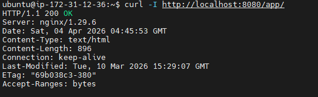

# Day20 — Docker Compose 멀티 컨테이너 구조 전환

## 목표

기존 단일 컨테이너 compose 구조를 nginx 컨테이너 + app 컨테이너로 분리하고
컨테이너 간 내부 네트워크 통신 구조를 이해한다.

## 오늘 한 일

- docker-compose.yaml을 멀티 컨테이너 구조로 수정했다.
- nginx 컨테이너용 설정 파일 `nginx/default.conf` 를 작성했다.
- compose 내부 네트워크에서 nginx 컨테이너가 app 컨테이너를
  upstream으로 바라보는 구조로 전환했다.
- app 컨테이너를 중지해서 502 Bad Gateway를 재현했다.
- app 컨테이너를 다시 시작해서 200 OK로 복구했다.

## 오늘 배운 점

### nginx/default.conf 구조

nginx 컨테이너가 어떻게 동작할지 정의하는 설정 파일이다.
```nginx
server {
    listen 80;

    location /app/ {
        proxy_pass http://app/;
    }

    location / {
        root /usr/share/nginx/html;
        index index.html;
    }
}
```

- `listen 80` — nginx 컨테이너가 80번 포트에서 요청을 받는다
- `location /app/` — `/app/` 요청은 app 컨테이너로 넘긴다
- `proxy_pass http://app/` — IP 대신 서비스 이름을 주소로 쓴다.
  compose 내부 네트워크에서는 서비스 이름이 곧 호스트명이 된다.
  회사 내부 전화에서 IP 대신 내선번호로 연결하는 것과 비슷하다.
- `location /` — 나머지 요청은 nginx 기본 페이지로 응답한다

### docker-compose.yaml 구조
```yaml
services:
  nginx:
    image: nginx
    container_name: nginx-proxy
    ports:
      - "8080:80"
    volumes:
      - ./nginx/default.conf:/etc/nginx/conf.d/default.conf
    depends_on:
      - app
    restart: unless-stopped

  app:
    image: nginx
    container_name: app
    restart: unless-stopped
```

- `volumes` — 로컬 설정 파일을 컨테이너 안으로 마운트한다.
  USB를 꽂는 것처럼 내 파일을 컨테이너 안에서 읽을 수 있게 연결한다.
- `depends_on` — app 컨테이너가 먼저 뜬 다음 nginx 컨테이너가 시작된다.
- `app 서비스에 ports 없음` — 호스트에서 직접 접근 불가.
  compose 내부 네트워크에서만 접근 가능하다.

### 호스트 nginx vs 컨테이너 nginx

오늘 실습 중에 중요한 점을 확인했다.
현재 서버에는 nginx가 두 개 동작하고 있다.
호스트 nginx   → 80포트  (systemctl로 설치된 것)
nginx 컨테이너 → 8080포트 (compose로 띄운 것)

app 컨테이너를 내리고 80포트로 접근하면 호스트 nginx가 응답해서 200이 나왔다.
502를 보려면 8080포트로 접근해야 했다.
nginx 컨테이너 → app 컨테이너 흐름이 8080포트에서 일어나기 때문이다.

### 502의 의미

app 컨테이너가 죽으면 nginx 컨테이너가 upstream으로 요청을 넘기려 하지만
연결할 대상이 없어서 502 Bad Gateway가 발생한다.
nginx 자체가 죽은 게 아니라 뒤쪽 대상이 없는 것이다.
이전에 호스트 nginx에서 경험한 502와 원인이 동일하다.

## 결과/증거

- 멀티 컨테이너 구조 전환 완료
- 502 재현 및 복구 확인



## 막힌 점

- 처음에 홈 디렉토리에서 compose up 실행 시 에러가 났다.
  에러 메시지가 파일 위치 문제처럼 보였지만
  실제로는 yaml 파일 내용 문제였다.
- app 컨테이너를 내린 후 80포트로 접근했을 때 200이 나와서
  재현이 안 된 줄 알았지만 호스트 nginx가 응답한 것이었다.
  포트별로 어떤 nginx가 응답하는지 구분해서 확인해야 한다는 점을 배웠다.