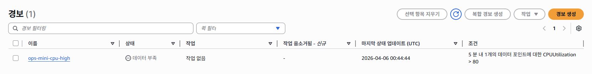
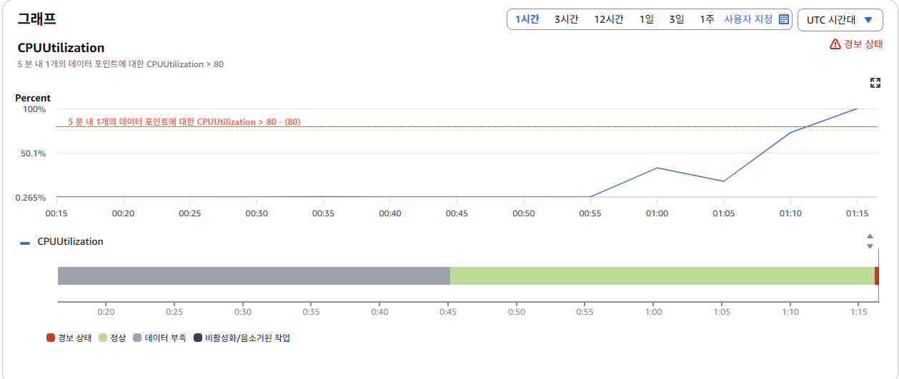
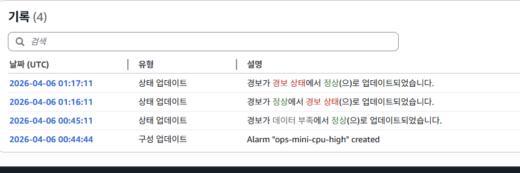
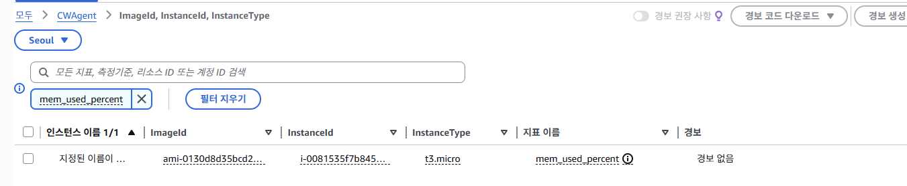

# Day22 — CloudWatch CPU 알람 생성 및 CloudWatch Agent 설치

## 목표

- observability/ 폴더 구성
- AWS CloudWatch에서 EC2 CPU 알람 생성
- 실제 부하를 걸어 알람 트리거 확인
- CloudWatch Agent 설치로 메모리 지표 추가

## 오늘 한 일

- `observability/` 폴더를 생성하고 Week4 모니터링 기반을 잡았다.
- AWS CloudWatch 콘솔에서 `ops-mini-cpu-high` 알람을 생성했다.
  - 조건: CPUUtilization > 80%, 5분 1회
  - 액션: 없음 (1차 단계)
- `stress --cpu 2 --timeout 300` 명령으로 EC2 CPU에 인위적으로 부하를 줬다.
- CloudWatch 그래프에서 CPU가 80% 임계값을 넘는 것을 확인했다.
- 알람 상태가 "정상 → 경보 → 정상" 전체 사이클을 직접 확인했다.
- CloudWatch Agent를 설치하고 메모리 지표 수집을 추가했다.
- EC2에 IAM Role(CloudWatchAgentServerPolicy)을 연결하여 Agent가
  CloudWatch로 데이터를 전송할 수 있도록 권한을 부여했다.
- CloudWatch 콘솔 CWAgent 네임스페이스에서 `mem_used_percent` 지표가
  수집되는 것을 확인했다.

## 오늘 배운 점

- CloudWatch 기본 지표는 AWS 인프라 외부에서 수집되므로 CPU는 잡히지만
  메모리/디스크는 OS 내부 정보라 Agent 없이는 수집되지 않는다.
- CloudWatch Agent가 데이터를 전송하려면 EC2에 IAM Role이 붙어 있어야 한다.
  Role이 없으면 AWS가 "누구냐"를 확인할 수 없어 전송이 거부된다.
- 기본 CloudWatch 지표는 `AWS/EC2` 네임스페이스에,
  Agent가 수집한 지표는 `CWAgent` 네임스페이스에 따로 잡힌다.
- CPU 코어 수에 맞게 `stress --cpu 2` 로 설정해야 충분한 부하가 걸린다.
- 알람에 SNS 액션이 없으면 상태는 바뀌지만 실제 알림은 전송되지 않는다.

## 결과/증거

- `evidence/day22-cloudwatch-alarm.png` — 알람 생성 화면

- `evidence/day22-cloudwatch-alarm-triggered.png` — 경보 상태 화면

- `evidence/day22-cloudwatch-alarm-history.png` — 전체 상태 변화 기록

- `evidence/day22-cwagent-mem-metric.png` — CWAgent 메모리 지표 수집 확인

## 막힌 점

- CPU 코어가 2개인 환경에서 `--cpu 1` 로는 80%를 넘기기 어려웠다.
- CloudWatch Agent 설정 마법사에서 EC2 대신 On-Premises를 선택해
  IAM Role을 찾지 못하는 에러가 발생했다. 설정을 다시 실행해서 해결했다.
- EC2에 IAM Role이 없으면 Agent가 데이터를 전송하지 못한다는 점을
  에러 로그를 통해 직접 확인했다.