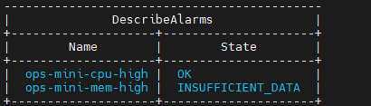
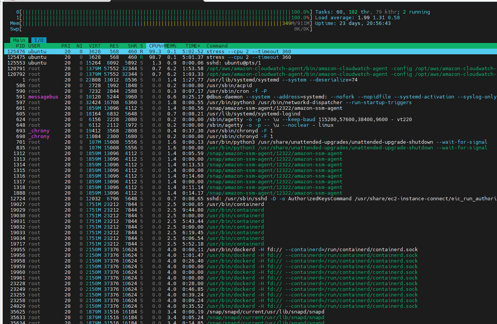

# Day23 — 모니터링 대응 Runbook 작성

## 목표

- 메모리 알람(ops-mini-mem-high)을 추가한다.
- CPU / 메모리 알람 기준으로 모니터링 대응 절차를 runbook으로 정리한다.

## 오늘 한 일

- AWS CLI가 설치되어 있지 않아 `snap install aws-cli --classic` 으로 설치했다.
- IAM Role(`ops-mini-cloudwatch-role`)에 `CloudWatchReadOnlyAccess` 정책을 추가했다.
- `aws cloudwatch describe-alarms` 명령어로 알람 목록과 상세 정보를 조회했다.
- CloudWatch 콘솔에서 메모리 알람(`ops-mini-mem-high`)을 추가했다.
  - 지표: CWAgent `mem_used_percent`
  - 임계값: 80% 초과 / 평가 기간: 5분 1회
- `aws cloudwatch describe-alarms` 로 두 알람 상태를 확인했다.
- `runbook/monitoring-response.md` 를 작성했다.
  - 알람 감지 → 확인 → 조치 → 복구 → 기록 흐름 정리
  - CPU / 메모리 알람별 확인 명령어 및 조치 방법 포함

## 오늘 배운 점

- `aws cloudwatch describe-alarms` 는 알람 이름, 상태, 임계값, 평가 주기를 한 번에 조회할 수 있다.
- runbook에는 내가 실제로 이해하고 사용할 수 있는 명령어만 담아야 한다.
  - 이해 없이 복붙한 명령어는 장애 상황에서 오히려 혼란을 줄 수 있다.
- CPU 알람이 울렸을 때 바로 프로세스를 종료하지 않고 `top`, `ps`, `docker stats` 로 먼저 원인을 파악해야 한다.
  - 종료해도 되는 프로세스인지 확인하지 않으면 더 큰 장애로 이어질 수 있다.
- 리눅스는 남는 메모리를 디스크 캐시로 자동으로 채운다.
  - 메모리 사용률이 높아 보여도 캐시가 대부분인 경우가 많다.
  - 캐시는 다른 프로세스가 메모리를 필요로 하면 리눅스가 알아서 비워주므로 바로 조치할 필요가 없다.

## 결과/증거

- `aws cloudwatch describe-alarms` 

- `top` 에서 CPU 100% 확인 캡처

- `runbook/monitoring-response.md` 작성 완료

## 막힌 점

없음.