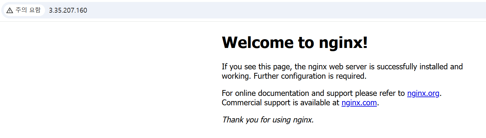

# INC-001 — UFW blocked HTTP(80)
 
## Summary
 
UFW 정책 변경으로 인해 EC2 외부에서 HTTP(80) 접속이 실패했다.
nginx 서비스 자체는 정상 동작했으며 서버 내부 localhost 접근은 가능했다.
 
---
 
## Severity
 
**Low** — 의도적 재현 실습. 외부 접근 실패지만 서비스 자체는 살아 있었음.
 
| 등급 | SLA Response | SLA Resolution |
|------|-------------|----------------|
| Low | 인지 즉시 확인 | 당일 복구 |
 
---
 
## Impact
 
- External client → `http://<PUBLIC_IP>` 접속 실패
- Internal localhost → 정상 응답 유지
- 사용자 입장에서는 웹페이지 장애처럼 보임
- nginx 서비스 자체에는 영향 없음
 
---
 
## Detection
 
```bash
curl -I http://<PUBLIC_IP>       # 외부에서 접근 실패 확인
curl -I http://localhost          # 내부에서 200 OK 확인
systemctl is-active nginx         # nginx 서비스 정상
sudo ufw status verbose           # 80/tcp deny 규칙 확인
ss -lntp | grep :80               # 포트 80 리슨 상태 확인
```
 
---
 
## Timeline
 
| 순서 | 내용 |
|------|------|
| 1 | 외부 접속 정상 확인 |
| 2 | UFW에서 80/tcp 차단 |
| 3 | 외부 접속 실패 재현 |
| 4 | 내부 localhost 정상 응답 확인 |
| 5 | UFW에서 80/tcp 다시 허용 |
| 6 | 외부 접속 복구 확인 |
 
---
 
## Symptoms
 
- 외부에서 `curl -I http://<PUBLIC_IP>` 요청 실패
- 서버 내부 `curl -I http://localhost` 는 200 OK 정상 응답
- nginx 서비스는 active 상태 유지
 
---
 
## Root Cause
 
서버 내부 방화벽(UFW)에서 80/tcp가 차단되어 외부 HTTP 요청이 nginx까지 도달하지 못했다.
nginx 자체는 정상이었으나 네트워크 계층에서 패킷이 차단되었다.
 
---
 
## Recovery
 
```bash
sudo ufw allow 80/tcp
```
 
---
 
## Validation After Recovery
 
```bash
sudo ufw status verbose           # 80/tcp allow 규칙 확인
curl -I http://localhost          # 내부 200 OK 확인
curl -I http://<PUBLIC_IP>       # 외부 200 OK 확인
```
 
검증 결과:
- UFW 규칙에서 80/tcp allow 확인
- 내부/외부 모두 HTTP 200 정상 응답
 
---
 
## Prevention
 
- 외부 장애 발생 시 nginx 상태와 방화벽 상태를 분리해서 점검한다.
- 서비스(localhost) 정상 여부와 외부 접근(Public IP) 여부를 함께 확인한다.
- UFW 변경 전/후 상태를 evidence로 남긴다.
 
---
 
## Evidence
 
