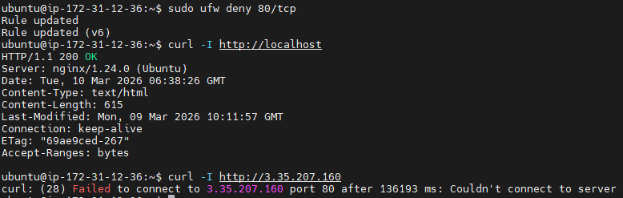
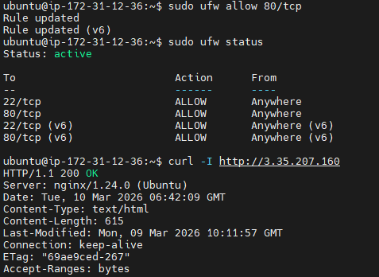

# INC-001 — UFW blocked HTTP(80)


## Summary

UFW 정책 변경으로 인해 EC2 외부에서 HTTP(80) 접속이 실패했다. nginx 서비스 자체는 정상 동작했으며, 서버 내부 localhost 접근은 가능했다.


## Impact

- External client → `http://<PUBLIC\_IP>` 접속 실패

- Internal localhost → 정상 응답

- 사용자 입장에서는 웹페이지 장애처럼 보임


## Detection

- Local PC에서 `curl -I http://<PUBLIC\_IP>` 실패

- EC2에서 `curl -I http://localhost`는 200 OK

- `systemctl is-active nginx` 결과는 active

- `sudo ufw status verbose`에서 80/tcp deny 규칙 확인


## Timeline

1. 외부 접속 정상 확인

2. UFW에서 80/tcp 차단

3. 외부 접속 실패 재현

4. 내부 localhost 정상 확인

5. UFW에서 80/tcp 다시 허용

6. 외부 접속 복구 확인


## Root Cause

서버 내부 방화벽(UFW)에서 80/tcp가 차단되어 외부 HTTP 요청이 서버 애플리케이션까지 도달하지 못했다.


## Verification Commands

- `systemctl is-active nginx`

- `curl -I http://localhost`

- `curl -I http://<PUBLIC\_IP>`

- `sudo ufw status verbose`

- `ss -lntp | grep :80`


## Recovery

```bash

sudo ufw allow 80/tcp
```


##Preventive Actions


-외부 장애 발생 시 nginx 상태와 방화벽 상태를 분리해서 점검한다.


-서비스(localhost) 정상 여부와 외부 접근(Public IP) 여부를 함께 확인한다.


-UFW 변경 전/후 상태를 evidence로 남긴다.


## Evidence







