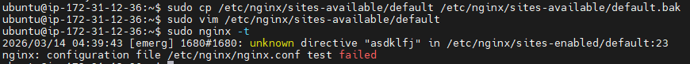

# INC-002 — Nginx config test fail
 
## Summary
 
Nginx 설정 파일에 의도적으로 문법 오류를 추가한 뒤 `sudo nginx -t` 검사 실패를 확인했다.
이후 백업 파일로 원복하고 다시 검사를 수행하여 정상 상태로 복구했다.
 
---
 
## Severity
 
**Low** — 의도적 재현 실습. `nginx -t` 가 reload 전에 오류를 차단하여 서비스 영향 없음.
 
| 등급 | SLA Response | SLA Resolution |
|------|-------------|----------------|
| Low | 인지 즉시 확인 | 당일 복구 |
 
---
 
## Impact
 
- 잘못된 설정이 실제 서비스 reload 전에 차단되었다.
- nginx 서비스 자체에는 영향 없음.
- 설정 변경 전 백업과 사전 문법 검사의 필요성을 확인했다.
 
---
 
## Detection
 
```bash
sudo nginx -t
# nginx: [emerg] ... 오류 메시지 출력
# nginx: configuration file /etc/nginx/nginx.conf test failed
```
 
---
 
## Timeline
 
| 순서 | 내용 |
|------|------|
| 1 | `/etc/nginx/sites-available/default` 백업 생성 |
| 2 | 설정 파일에 의도적 문법 오류 1줄 추가 |
| 3 | `sudo nginx -t` 실행 → 검사 실패 확인 |
| 4 | 백업 파일로 원복 |
| 5 | `sudo nginx -t` 재실행 → 성공 확인 |
| 6 | `sudo systemctl reload nginx` 로 정상 서비스 유지 |
 
---
 
## Symptoms
 
- `sudo nginx -t` 실행 시 `configuration file test failed` 메시지 출력
- reload는 수행하지 않았으므로 실제 서비스에는 영향 없음
 
---
 
## Root Cause
 
`/etc/nginx/sites-available/default` 파일에 nginx 문법에 맞지 않는 라인이 포함되었다.
`nginx -t` 는 이 오류를 reload 전에 탐지하여 잘못된 설정이 서비스에 적용되는 것을 막았다.
 
---
 
## Recovery
 
```bash
# 백업 파일로 원복
cp /etc/nginx/sites-available/default.bak /etc/nginx/sites-available/default
 
# 문법 재확인
sudo nginx -t
 
# 서비스 유지
sudo systemctl reload nginx
```
 
---
 
## Validation After Recovery
 
```bash
sudo nginx -t                  # 문법 검사 성공 확인
systemctl is-active nginx      # nginx active 확인
curl -I http://localhost       # HTTP 200 OK 확인
```
 
검증 결과:
- `nginx -t` 성공
- nginx active 상태 유지
- localhost 200 OK 정상 응답
 
---
 
## Prevention
 
- 설정 변경 전 반드시 백업을 수행한다.
- reload 전에 반드시 `sudo nginx -t` 를 수행한다.
- 운영 문서에 nginx 설정 변경 절차를 고정한다.
 
---
 
## Evidence
 

