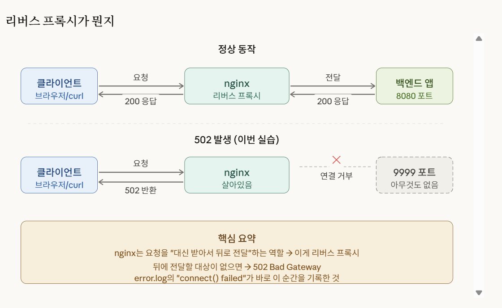
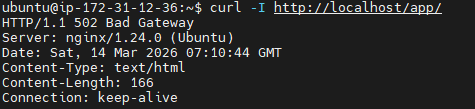
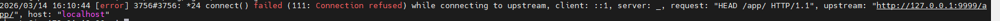

# INC-003-502 Bad Gateway caused by wrong upstream port

## Summary

Day6 실습 중 nginx에 `/app/` reverse proxy 설정을 추가한 뒤, `proxy_pass` 대상 포트를 일부러 잘못 지정하여 502 Bad Gateway를 재현했다. 이후 nginx error.log와 snapshot 스크립트로 증거를 수집하고, 설정을 원복하여 복구했다.

## Severity

Low

## Impact

- `/app/` 경로 요청이 정상 처리되지 않음
- 메인 정적 페이지(`/`)는 정상 유지
- nginx 서비스 자체는 살아 있었지만 upstream 연결 실패로 502 발생

## Time

- Date: 2026-03-14
- Stage: Day6 practice

## Symptoms

- `curl -I http://localhost/app/` 실행 시 `502 Bad Gateway` 반환
- nginx error.log에 upstream 연결 실패 관련 로그가 기록됨

## Detection

- 수동 검증(`curl -I http://localhost/app/`)
- `scripts/log_snapshot.sh` 실행 결과 확인
- `/var/log/nginx/error.log` 확인

## Root Cause

`location /app/` 블록의 `proxy_pass`가 실제 서비스가 없는 포트를 가리키도록 설정되어 있었다. nginx는 요청을 받았지만 backend upstream에 연결할 수 없어 502를 반환했다.

## Evidence

- `evidence/<timestamp>/system_state.txt`
- `evidence/<timestamp>/http_local.txt`
- `evidence/<timestamp>/nginx_error_tail.txt`
- 502 응답 캡처

- error.log 캡처

## Actions Taken

1. nginx 설정 파일에 `/app/` reverse proxy location 추가
2. `proxy_pass http://127.0.0.1:9999;` 로 설정
3. `sudo nginx -t` 로 문법 확인
4. `sudo systemctl reload nginx` 로 설정 반영
5. `curl -I http://localhost/app/` 로 502 확인
6. `./scripts/log_snapshot.sh` 실행
7. `sudo tail -n 50 /var/log/nginx/error.log` 로 원인 단서 확인
8. `/app/` 설정을 원복 또는 정상 포트로 수정
9. 다시 `sudo nginx -t && sudo systemctl reload nginx`
10. 복구 후 healthcheck 및 재검증 수행

## Validation After Recovery

- `systemctl is-active nginx` → active
- `curl -I http://localhost` → 200 OK
- `/app/` 관련 실습 설정 원복 후 기존 nginx 동작 정상 확인
- snapshot 결과 저장 확인

## Prevention

- reverse proxy 실습 전 실제 backend 포트 존재 여부를 먼저 확인한다
- nginx 설정 변경 후 항상 `nginx -t` 후 reload 한다
- 장애 발생 즉시 snapshot 스크립트로 증거를 수집한다
- troubleshooting 문서에 502 체크리스트를 유지한다

## What I Learned

502는 nginx 자체가 죽었다는 뜻이 아니라 nginx가 upstream backend에 연결하지 못했을 때도 발생할 수 있다. 따라서 서비스 상태, 포트 리슨 여부, proxy_pass 대상, error.log를 함께 확인해야 한다.

