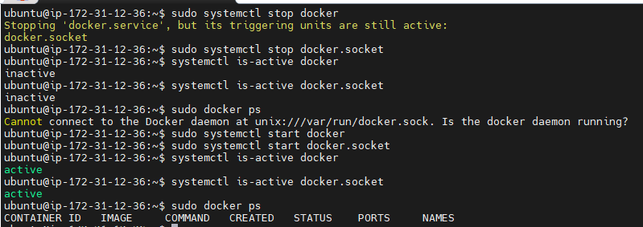

# INC-005 — Docker service down


## Summary

Docker 서비스 중지 및 복구 절차를 실습하는 과정에서 `docker.service`만 중지하면 Docker가 완전히 내려가지 않는다는 점을 확인했다. 이후 `docker.socket` 까지 함께 중지해 실제 장애 상태를 재현했고 다시 시작하여 정상 복구를 확인했다.


## Symptoms

- `sudo systemctl stop docker` 실행 후 아래 메시지 확인
- `Stopping 'docker.service', but its triggering units are still active: docker.socket`
- `docker.service`만 중지했을 때는 완전한 중단 상태가 아님
- `docker.socket` 까지 중지한 뒤 `sudo docker ps` 실행 시 Docker daemon 연결 실패 발생


## What happened

처음에는 `docker.service`만 중지하면 Docker가 완전히 멈출 것이라고 생각했다.  

하지만 systemd가 `docker.socket` 이 아직 active 상태라고 알려주었고 이 상태에서는 Docker 관련 요청이 다시 서비스를 깨울 수 있다는 점을 확인했다.  

따라서 완전한 장애 재현을 위해 `docker.socket` 도 함께 중지했다.


## Detection

```bash
systemctl is-active docker
systemctl is-active docker.socket
sudo docker ps
```


## 확인 결과:

- docker → inactive
- docker.socket → inactive
- sudo docker ps → Docker daemon 연결 실패


## Root Cause

Docker는 docker.service 와 docker.socket 이 함께 동작할 수 있다.

이번 실습에서는 docker.service만 중지했기 때문에 완전한 장애 상태가 아니었고 docker.socket 까지 함께 중지해야 의도한 장애가 재현되었다.


## Recovery

```bash
sudo systemctl start docker
sudo systemctl start docker.socket
systemctl is-active docker
systemctl is-active docker.socket
sudo docker ps
```


## Validation

복구 후 다음을 확인했다.

```bash
systemctl is-active docker → active
systemctl is-active docker.socket → active
sudo docker ps 정상 출력
```


## Evidence



Docker service/socket 중지, docker ps 실패, 재기동 후 복구까지 포함한 캡처


## Prevention
- Runbook에 service와 socket을 함께 다루는 절차를 명시한다.
- 이후 배포/운영 점검 시 Docker daemon과 socket 상태를 함께 확인한다.

