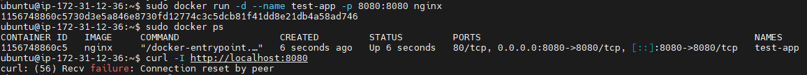
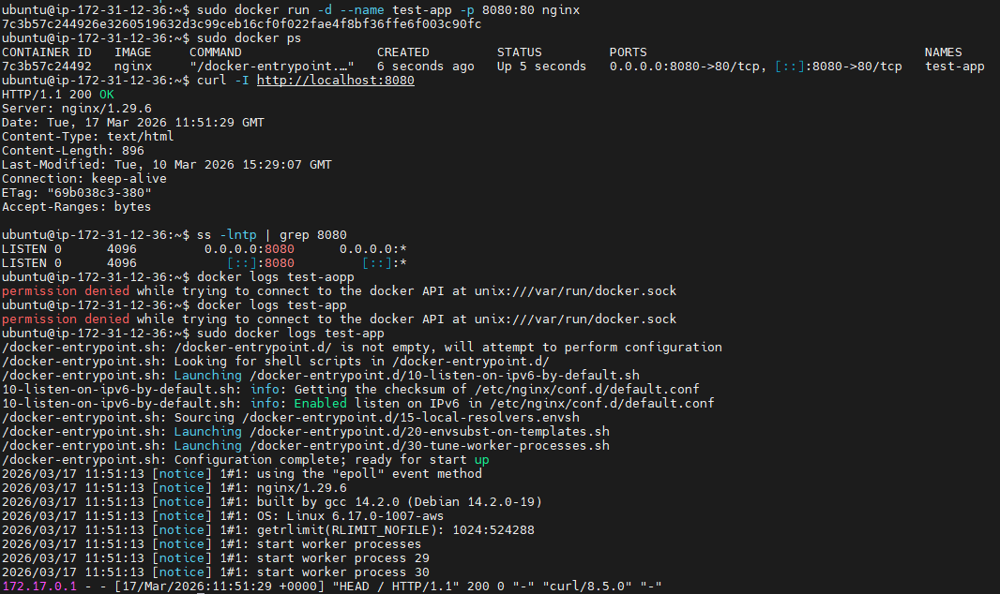

## Summary

테스트 앱 컨테이너를 실행하는 과정에서 포트 매핑을 잘못 지정하여 `localhost:8080` 접속이 실패했다. 컨테이너 자체는 실행 중이었지만 요청이 실제 서비스가 동작하는 포트에 전달되지 않아 HTTP 접근이 불가능했다.


## Severity

Low


## Impact

호스트에서 앱 컨테이너로의 HTTP 접근이 불가능했다.  
운영 중인 호스트 nginx에는 영향이 없었지만 Day10의 Reverse Proxy 연결 전제 조건인 백엔드 앱 접근이 성립하지 않았다.


## Detection

아래 명령으로 문제를 확인했다.

```bash
docker ps
curl -I http://localhost:8080
ss -lntp | grep 8080
docker logs test-app
```

docker ps 상 컨테이너는 Up 상태였지만, curl -I http://localhost:8080 요청은 실패했다.

## Timeline

- 테스트 앱 컨테이너 실행
- p 8080:8080 으로 포트 매핑 설정
- docker ps 로 컨테이너 실행 상태 확인
- curl -I http://localhost:8080 실패 확인
- 포트 매핑을 다시 검토하여 컨테이너 내부 서비스 포트가 80임을 확인
- 기존 컨테이너 삭제 후 -p 8080:80 으로 재실행
- curl -I http://localhost:8080 → 200 OK 확인


## Symptoms

- 컨테이너는 실행 중이었음
- 호스트의 8080 포트 접근 실패
- 서비스가 죽은 것처럼 보였지만 실제 원인은 포트 매핑 오류였음


## Root Cause

- nginx 컨테이너는 기본적으로 내부 80 포트에서 HTTP 서비스를 제공한다.
- 하지만 컨테이너 실행 시 -p 8080:8080 으로 잘못 설정하여 호스트 8080 요청이 컨테이너 8080으로 전달되었다. 컨테이                  너 내부 8080 포트에는 서비스가 리슨하지 않아 접속이 실패했다.


## Recovery

- 잘못 실행한 컨테이너를 삭제한 뒤, 올바른 포트 매핑으로 다시 실행했다.

```bash
docker rm -f test-app
docker run -d --name test-app -p 8080:80 nginx
Validation After Recovery
```

아래 명령으로 복구를 검증했다.

```bash
docker ps
curl -I http://localhost:8080
curl http://localhost:8080
ss -lntp | grep 8080
docker logs test-app
```

검증 결과:

- docker ps 에서 0.0.0.0:8080->80/tcp 확인
- curl -I http://localhost:8080 에서 HTTP/1.1 200 OK 확인
- curl http://localhost:8080 으로 앱 응답 확인


## Prevention

- 컨테이너 실행 전 이미지의 내부 서비스 포트를 먼저 확인한다.
- docker run 명령의 호스트포트:컨테이너포트 순서를 다시 확인한다.
- 표준 컨테이너 이름과 표준 포트를 문서화한다.
- baseline check에 앱 컨테이너 상태와 앱 응답 검사를 추가한다.


## Evidence






