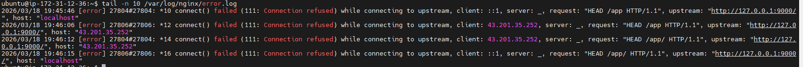
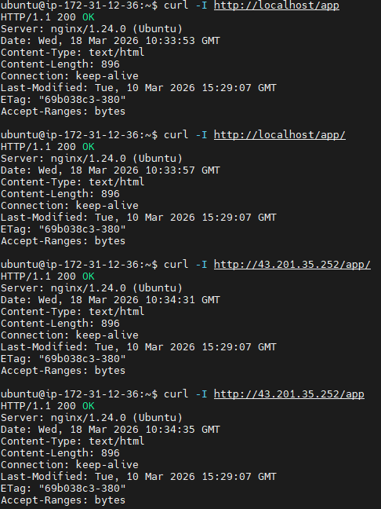

# INC-006 — Nginx Reverse Proxy 502 (Wrong Upstream Port)
 
## Summary
 
Nginx에 `/app` reverse proxy를 추가하는 과정에서 `proxy_pass` 의 upstream 포트를 실제 Docker 앱 포트와 다르게 설정하여 `502 Bad Gateway` 가 발생했다.
Nginx 자체는 정상 동작했지만 `/app` 요청이 백엔드 앱으로 전달되지 않았고, `error.log` 확인 후 정상 포트로 수정하여 복구했다.
 
---
 
## Severity
 
**Low** — 의도적 재현 실습. `/app` 경로만 영향, 호스트 nginx 서비스에는 영향 없음.
 
| 등급 | SLA Response | SLA Resolution |
|------|-------------|----------------|
| Low | 인지 즉시 확인 | 당일 복구 |
 
---
 
## Impact
 
- `/app` 경로를 통한 Docker 앱 접근 불가
- 외부/public IP 기준 `/app` 접근도 실패
- 호스트 nginx 서비스 자체에는 영향 없음
 
---
 
## Detection
 
```bash
curl -I http://localhost/app              # 502 Bad Gateway 확인
curl -I http://<PUBLIC_IP>/app           # 외부에서도 502 확인
curl http://localhost:8080               # Docker 앱 직접 접근 → 정상 응답
sudo tail -n 20 /var/log/nginx/error.log # upstream 연결 실패 로그 확인
```
 
---
 
## Timeline
 
| 순서 | 내용 |
|------|------|
| 1 | Docker 앱 `localhost:8080` 정상 응답 확인 |
| 2 | nginx 설정에 `/app` reverse proxy 추가 |
| 3 | `proxy_pass` 를 일부러 잘못된 upstream 포트로 설정 |
| 4 | `sudo nginx -t` 문법 확인 (문법은 정상) |
| 5 | `sudo systemctl reload nginx` |
| 6 | `curl -I http://localhost/app` → 502 Bad Gateway 확인 |
| 7 | `error.log` 에서 upstream 연결 실패 메시지 확인 |
| 8 | `proxy_pass` 를 정상 포트로 수정 |
| 9 | `sudo nginx -t` 후 reload |
| 10 | `/app` 정상 응답 확인 |
 
---
 
## Symptoms
 
- `/app` 요청 시 `502 Bad Gateway` 발생
- nginx 서비스 자체는 active 상태 유지
- Docker 앱은 `localhost:8080` 에서 정상 응답
- error.log에 아래 메시지 기록
  - `connect() failed (111: Connection refused) while connecting to upstream`
 
즉, 앱이 죽은 것이 아니라 nginx가 upstream 연결에 실패한 상태였음.
 
---
 
## Root Cause
 
nginx reverse proxy 설정의 `proxy_pass` 값이 실제 Docker 앱이 열려 있는 주소/포트와 일치하지 않았다.
그 결과 `/app` 요청이 백엔드 컨테이너로 전달되지 못했고, nginx가 upstream 연결 실패를 `502 Bad Gateway` 로 반환했다.
`nginx -t` 는 문법만 검사하므로 포트 존재 여부는 탐지하지 못한다.
 
---
 
## Recovery
 
```bash
# proxy_pass를 정상 upstream 주소/포트로 수정
sudo nginx -t
sudo systemctl reload nginx
```
 
---
 
## Validation After Recovery
 
```bash
curl -I http://localhost/app         # 정상 HTTP 응답 확인
curl -I http://<PUBLIC_IP>/app      # 외부 정상 응답 확인
curl http://localhost:8080           # Docker 앱 직접 응답 유지 확인
sudo tail -n 20 /var/log/nginx/error.log  # 추가 에러 없음 확인
```
 
검증 결과:
- `curl -I http://localhost/app` 정상 HTTP 응답 확인
- `curl -I http://<PUBLIC_IP>/app` 정상 HTTP 응답 확인
- Docker 앱 직접 응답 유지 확인
- reverse proxy 복구 후 `/app` 경로 정상 동작 확인
 
---
 
## Prevention
 
- reverse proxy 연결 전 백엔드 앱 직접 응답(`curl http://localhost:8080`)을 먼저 확인한다.
- `proxy_pass` 의 IP/포트를 실제 실행 중인 서비스와 대조한다.
- 설정 변경 후 반드시 `sudo nginx -t` 를 먼저 수행한다.
- 502 발생 시 앱 자체 문제인지, reverse proxy 문제인지 분리해서 확인한다.
- `error.log` 를 먼저 확인하는 절차를 runbook에 반영한다.
 
---
 
## Evidence
 

