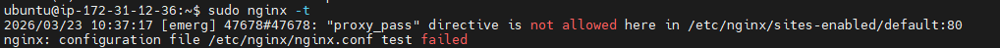
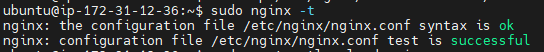

# INC-007 — Nginx 설정 변경 후 reload 누락
 
## Summary
 
Nginx 설정을 변경한 뒤 `nginx -t` 만 실행하고 `systemctl reload nginx` 를 수행하지 않아
변경 내용이 실제 서비스에 반영되지 않은 상황을 재현했다.
 
---
 
## Severity
 
**Low** — 의도적 재현 실습. 서비스 중단은 없었으나 설정이 반영되지 않은 상태.
 
| 등급 | SLA Response | SLA Resolution |
|------|-------------|----------------|
| Low | 인지 즉시 확인 | 당일 복구 |
 
---
 
## Impact
 
- 설정 변경이 반영됐다고 판단했지만 실제로는 이전 설정이 동작 중이었다.
- 이 상태에서 추가 변경이 발생하면 의도치 않은 설정이 누적될 수 있다.
- nginx 서비스 자체는 정상 동작 유지.
 
---
 
## Detection
 
```bash
sudo nginx -T | grep -A5 "location /app"
# → 실행 중인 nginx 설정과 파일 내용이 다름을 확인
 
curl -I http://localhost/app
# → 파일 변경 전후 응답이 동일 (reload 누락으로 반영 안 됨)
```
 
---
 
## Timeline
 
| 순서 | 내용 |
|------|------|
| 1 | nginx 설정 파일 변경 |
| 2 | `sudo nginx -t` 실행 → 문법 검사 성공 |
| 3 | reload 없이 변경 완료로 착각 |
| 4 | `sudo nginx -T` 로 실제 동작 설정 확인 → 변경 전 내용이 그대로 |
| 5 | `sudo systemctl reload nginx` 실행 |
| 6 | `curl` 로 변경 내용 반영 확인 |
 
---
 
## Symptoms
 
- `nginx -t` 는 성공했지만 실제 서비스 동작은 변경 전 설정 그대로
- `curl` 요청 결과가 파일 수정 전후로 동일하게 유지됨
- `nginx -T` 로 확인 시 메모리에 올라간 설정이 파일 내용과 다름
 
---
 
## Root Cause
 
`nginx -t` 는 설정 파일 문법 검사만 수행한다.
실제 nginx 프로세스에 변경을 반영하려면 반드시 `systemctl reload nginx` 를 수행해야 한다.
reload를 생략하면 변경 전 설정이 메모리에 그대로 남아 동작한다.
 
---
 
## Recovery
 
```bash
sudo systemctl reload nginx
curl -I http://localhost
curl -I http://localhost/app
```
 
---
 
## Validation After Recovery
 
```bash
sudo nginx -T | grep -A5 "location /app"  # 변경 내용 반영 확인
curl -I http://localhost                   # 200 OK 확인
curl -I http://localhost/app               # /app 정상 응답 확인
```
 
검증 결과:
- `nginx -T` 에서 변경된 설정 내용 확인
- localhost 및 `/app` 경로 정상 응답
 
---
 
## Prevention
 
- `deploy.md` 에 `nginx -t` → `systemctl reload nginx` → `curl 검증` 순서를 고정한다.
- reload 없이 배포를 완료한 것으로 착각하지 않도록 체크리스트를 유지한다.
 
---
 
## Evidence
 

