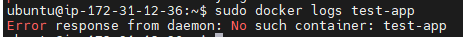
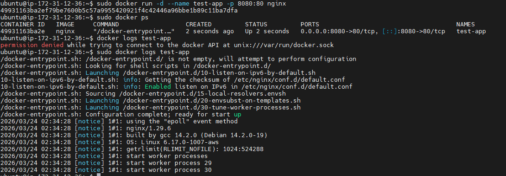

# INC-008 — docker logs 수집 실패 (컨테이너 없음)
 
## Summary
 
`log_snapshot.sh` 실행 또는 `docker logs` 명령 수행 시
`test-app` 컨테이너가 없는 상태여서 로그 수집에 실패했다.
 
---
 
## Severity
 
**Low** — 의도적 재현 실습. 컨테이너 부재 상태에서 로그 수집 실패를 확인함.
 
| 등급 | SLA Response | SLA Resolution |
|------|-------------|----------------|
| Low | 인지 즉시 확인 | 당일 복구 |
 
---
 
## Impact
 
- 장애 발생 시 앱 로그 수집 불가
- `log_snapshot.sh` 실행 시 docker logs 항목 누락
- nginx 서비스 및 호스트에는 영향 없음
 
---
 
## Detection
 
```bash
docker logs test-app
# Error response from daemon: No such container: test-app
```
 
---
 
## Timeline
 
| 순서 | 내용 |
|------|------|
| 1 | `test-app` 컨테이너 삭제 |
| 2 | `docker logs test-app` 실행 → 실패 확인 |
| 3 | `docker run -d --name test-app -p 8080:80 nginx` 로 복구 |
| 4 | `docker logs test-app` → 정상 출력 확인 |
 
---
 
## Symptoms
 
- `No such container: test-app` 메시지 출력
- `log_snapshot.sh` 의 docker logs 항목 수집 안 됨
 
---
 
## Root Cause
 
컨테이너가 없거나 중지된 상태에서 `docker logs` 를 실행하면 대상 컨테이너를 찾지 못해 실패한다.
`log_snapshot.sh` 에 에러 처리가 없으면 스크립트 전체가 중단될 수도 있다.
 
---
 
## Recovery
 
```bash
docker run -d --name test-app -p 8080:80 nginx
docker logs test-app
```
 
---
 
## Validation After Recovery
 
```bash
docker ps                          # test-app 컨테이너 Up 상태 확인
docker logs test-app               # 로그 정상 출력 확인
curl -I http://localhost:8080      # 앱 HTTP 응답 확인
./scripts/log_snapshot.sh          # 스크립트 정상 완료 확인
```
 
검증 결과:
- `docker ps` 에서 `test-app` 확인
- `docker logs test-app` 정상 출력
- `curl -I http://localhost:8080` → 200 OK
 
---
 
## Prevention
 
- `log_snapshot.sh` 에 컨테이너 없을 때 경고만 출력하고 스크립트가 중단되지 않도록 `|| echo "[WARN]..."` 처리를 추가한다.
- `baseline-check` 에 `docker ps` 항목을 유지한다.
 
---
 
## Evidence
 

