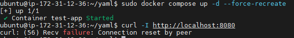
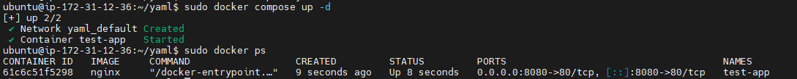

# INC-009-Docker Compose Port Misconfiguration
 
## Summary
 
`docker-compose.yml` 에 포트 매핑을 잘못 지정하여 `localhost:8080` 접속이 실패했다.
`8080:8080` 으로 설정했을 때 컨테이너 내부 8080 포트에 서비스가 없어 HTTP 요청이 실패했고,
`8080:80` 으로 수정 후 `docker compose up -d --force-recreate` 로 복구했다.
 
---
 
## Severity
 
**Low** — 의도적 재현 실습. 호스트 nginx 서비스에는 영향 없음.
 
| 등급 | SLA Response | SLA Resolution |
|------|-------------|----------------|
| Low | 인지 즉시 확인 | 당일 복구 |
 
---
 
## Impact
 
- 호스트에서 `curl http://localhost:8080` 접근 실패
- Nginx reverse proxy(`/app`)도 함께 접근 불가
- 운영 중인 호스트 nginx 자체에는 영향 없음
 
---
 
## Detection
 
```bash
docker compose up -d
curl -I http://localhost:8080
docker compose ps
docker logs test-app
```
 
- `docker compose ps` 에서 컨테이너는 Up 상태
- `curl -I http://localhost:8080` 요청 실패
 
---
 
## Timeline
 
| 순서 | 내용 |
|------|------|
| 1 | `docker-compose.yml` 최초 작성 (`8080:80` 정상 설정) |
| 2 | `docker compose up -d` 실행 후 정상 응답 확인 |
| 3 | 포트를 `8080:8080` 으로 의도적 오타 설정 |
| 4 | `docker compose up -d --force-recreate` 재실행 |
| 5 | `curl -I http://localhost:8080` 실패 확인 |
| 6 | `docker compose ps` 로 컨테이너 Up 상태 확인 → 서비스 접근 불가 상태 구분 |
| 7 | `docker-compose.yml` 포트를 `8080:80` 으로 수정 |
| 8 | `docker compose up -d --force-recreate` 재실행 |
| 9 | `curl -I http://localhost:8080` → 200 OK 확인 |
 
---
 
## Symptoms
 
- 컨테이너는 Up 상태 (`docker compose ps`)
- `curl -I http://localhost:8080` 실패
- `docker logs test-app` 에 요청 로그 없음 (요청 자체가 컨테이너에 도달하지 못함)
 
---
 
## Root Cause
 
`nginx` 이미지의 내부 서비스 포트는 80이다.
`8080:8080` 설정은 호스트 8080 → 컨테이너 8080으로 전달하지만,
컨테이너 내부 8080 포트에는 실제 서비스가 없기 때문에 HTTP 요청이 실패한다.
 
```
잘못된 설정:  host:8080 → container:8080  (nginx가 80에서만 수신)
올바른 설정:  host:8080 → container:80   (nginx 기본 포트와 일치)
```
 
> INC-005 (docker run 포트 오타)와 동일한 원인이지만,
> 이번에는 `docker-compose.yml` 선언 기반에서 재현했다.
 
---
 
## Recovery
 
```bash
# docker-compose.yml 포트 수정
# ports: "8080:8080" → "8080:80"
 
docker compose up -d --force-recreate
```
 
---
 
## Validation After Recovery
 
```bash
docker compose ps                  # 0.0.0.0:8080->80/tcp 확인
curl -I http://localhost:8080      # HTTP/1.1 200 OK 확인
curl http://localhost:8080         # 응답 본문 확인
docker logs test-app               # GET 요청 로그 기록 확인
```
 
검증 결과:
- `docker compose ps` 에서 `0.0.0.0:8080->80/tcp` 확인
- `curl -I http://localhost:8080` → `HTTP/1.1 200 OK`
- `docker logs test-app` 에 GET 요청 로그 기록 확인
 
---
 
## Prevention
 
- `docker-compose.yml` 작성 시 `호스트포트:컨테이너포트` 순서와 컨테이너 내부 포트를 이미지 문서에서 먼저 확인한다.
- compose 기반 변경 후에는 `docker compose ps` 와 `curl` 을 함께 실행한다.
- `docker compose ps` 상태가 Up이어도 서비스 접근 가능 여부는 별도로 확인한다.
 
---
 
## Evidence
 

