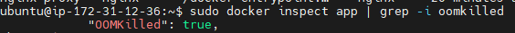
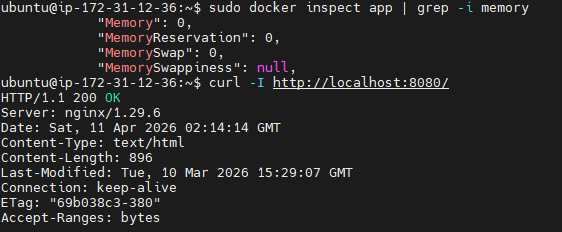

# INC-012 — 컨테이너 메모리 제한 초과 (OOM)

## Summary

`docker-compose.yaml`에 app 컨테이너 메모리 제한(`mem_limit: 50m`)을 추가한 뒤,
컨테이너 내부에서 패키지 설치를 시도하여 OOM 상황을 재현했다.
`apt-get`이 메모리 50MB 제한을 초과하여 커널이 프로세스를 강제 종료했고,
`OOMKilled: true` 로 확인했다. 이후 제한을 제거하여 복구했다.

## Severity

Low

## Impact

- app 컨테이너 내부 프로세스가 강제 종료됨
- `restart: unless-stopped` 설정으로 컨테이너는 자동 재시작
- 호스트 nginx 및 nginx-proxy 컨테이너에는 영향 없음

## Detection

```bash
sudo docker inspect app | grep -i oomkilled
# "OOMKilled": true
```

## Timeline

| 순서 | 내용 |
|------|------|
| 1 | `docker-compose.yaml`에 `mem_limit: 50m` 추가 |
| 2 | `docker compose up -d --force-recreate` 실행 |
| 3 | `docker inspect app | grep -i memory` 로 52428800(50MB) 적용 확인 |
| 4 | 컨테이너 내부에서 `apt-get install -y stress` 실행 |
| 5 | `Killed` 메시지 출력 — OOM 발생 |
| 6 | `docker inspect app | grep -i oomkilled` → `OOMKilled: true` 확인 |
| 7 | `docker-compose.yaml`에서 `mem_limit: 50m` 제거 |
| 8 | `docker compose up -d --force-recreate` 로 복구 |
| 9 | `docker inspect app | grep -i memory` → `Memory: 0` 확인 |

## Symptoms

- 컨테이너 내부에서 명령 실행 시 `Killed` 출력
- 컨테이너는 자동 재시작되어 `docker compose ps` 상 Up 상태 유지
- 로그나 상태만 보면 OOM 발생 여부를 모를 수 있음

## Root Cause

app 컨테이너에 `mem_limit: 50m` 제한이 설정된 상태에서
`apt-get`이 패키지 목록을 받는 과정에서 50MB를 초과했다.
리눅스 커널의 OOM Killer가 해당 프로세스를 강제 종료했다.

## Recovery

```bash
# docker-compose.yaml에서 mem_limit: 50m 제거
sudo docker compose up -d --force-recreate
```

## Validation After Recovery

```bash
sudo docker inspect app | grep -i memory
# Memory: 0 (제한 없음 확인)
curl -I http://localhost:8080
# 200 OK 확인
```

## Prevention

- 메모리 제한은 컨테이너가 실제로 사용하는 메모리보다 충분히 크게 설정한다.
- `docker stats --no-stream` 으로 정상 상태 메모리 사용량을 먼저 확인한 뒤 제한값을 결정한다.
- OOM 발생 여부는 `docker inspect`의 `OOMKilled` 필드로 확인한다.
- `restart: unless-stopped` 가 있으면 OOM 후 자동 재시작되므로 로그를 별도로 확인해야 한다.

## Evidence


