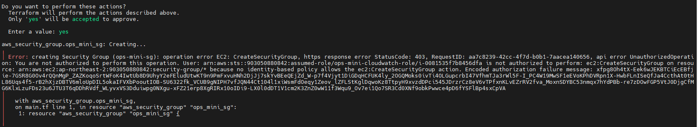
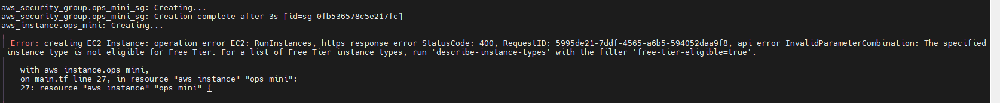
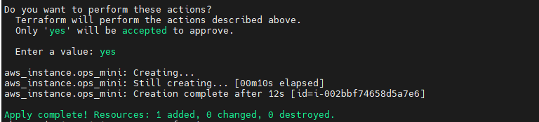
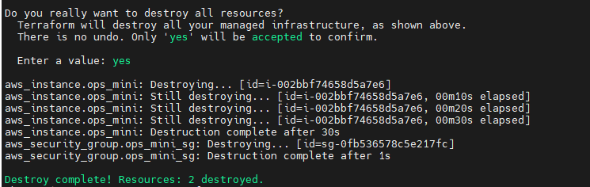

# INC-013 — Terraform apply 실패 (IAM 권한 부족 + 인스턴스 타입 오류)

## Summary

Day26 Terraform apply 실습 중 두 가지 오류로 인해 EC2 인스턴스 생성에 실패했다.
첫 번째는 IAM Role 권한 부족(403), 두 번째는 t2.micro가 해당 리전 프리티어 대상이 아닌 문제(400)였다.
각각 권한 추가와 인스턴스 타입 수정으로 해결했고 최종적으로 apply 성공 후 destroy까지 완료했다.

## Severity

Low

## Impact

- Terraform apply 실행 시 EC2 및 Security Group 생성 불가
- 수동 개입(IAM 정책 추가, main.tf 수정) 없이는 인프라 생성 불가능한 상태

## Detection

```bash
terraform apply
```

- 1차 오류: `UnauthorizedOperation: ec2:CreateSecurityGroup` (HTTP 403)
- 2차 오류: `InvalidParameterCombination: t2.micro not eligible for Free Tier` (HTTP 400)

## Timeline

- `terraform plan` 정상 확인
- `terraform apply` 실행 → IAM 권한 부족으로 Security Group 생성 실패 (403)
- AWS 콘솔에서 `ops-mini-cloudwatch-role`에 `AmazonEC2FullAccess` 정책 추가
- `terraform apply` 재실행 → t2.micro 프리티어 불가로 EC2 생성 실패 (400)
- `main.tf`에서 `instance_type`을 `t2.micro` → `t3.micro`로 수정
- `terraform apply` 재실행 → EC2 + Security Group 생성 성공
- `terraform destroy` → 리소스 2개 삭제 완료

## Symptoms

- 1차: Security Group 생성 직후 403 UnauthorizedOperation 오류
- 2차: Security Group은 생성되었으나 EC2 생성 단계에서 400 오류

## Root Cause

1. EC2 인스턴스에 연결된 IAM Role(`ops-mini-cloudwatch-role`)이 CloudWatch 읽기 권한만 보유하고 있었다. Terraform이 EC2 위에서 실행될 때 이 Role을 통해 AWS API를 호출하므로 EC2/Security Group 생성 권한이 없어 403이 발생했다.

2. `main.tf`에 지정한 `t2.micro`가 서울 리전(`ap-northeast-2`)에서 프리티어 대상 인스턴스 타입이 아니었다. 이는 plan 단계에서는 감지되지 않고 apply 단계에서 AWS API 호출 시 확인되었다.

## Recovery

```bash
# IAM Role에 정책 추가 (AWS 콘솔)
ops-mini-cloudwatch-role → AmazonEC2FullAccess 추가

# main.tf 수정
instance_type = "t3.micro"  # t2.micro → t3.micro

# 재실행
terraform apply
terraform destroy
```

## Validation After Recovery

```bash
terraform show   # 리소스 생성 확인
terraform destroy
terraform show   # No state 확인
```

## Prevention

- Terraform을 EC2 위에서 실행할 경우, 해당 인스턴스의 IAM Role에 필요한 권한이 있는지 사전 확인한다.
- 실습 편의상 `AmazonEC2FullAccess`를 사용했으나 실무에서는 최소 권한 원칙에 따라 필요한 Action만 허용하는 커스텀 정책을 적용해야 한다.
- `terraform plan`이 성공해도 인스턴스 타입, AMI ID 등 AWS API 호출 시점에 검증되는 값은 apply 단계에서 오류가 날 수 있다. plan 전에 리전별 지원 여부를 확인하는 습관이 필요하다.

## Evidence





