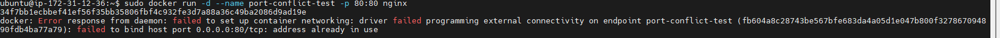
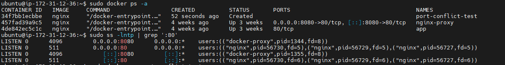
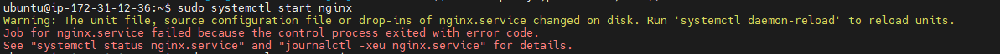
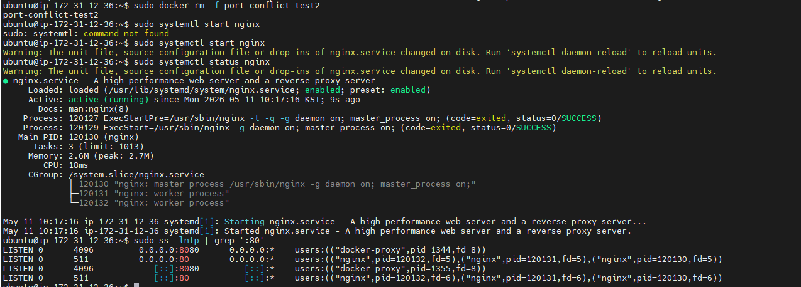

# INC-014 — 포트 충돌: nginx와 컨테이너가 동일 포트 사용 시도

## Summary

nginx가 호스트 80포트를 점유한 상태에서 동일 포트를 바인딩하려는 컨테이너를
실행하자 `address already in use` 에러가 발생했다.
컨테이너는 Created 상태로 멈췄고 ss -lntp로 점유 프로세스를 특정하여
원인을 확인한 뒤 컨테이너를 제거하고 복구했다.

## Severity

Low

## Impact

- 충돌을 시도한 컨테이너가 Up 상태가 되지 못하고 Created 상태로 멈춤
- 기존 nginx 서비스 및 8080 포트 컨테이너에는 영향 없음

## Detection

```bash
sudo docker run -d --name port-conflict-test -p 80:80 nginx
# 출력:
# docker: Error response from daemon: failed to set up container networking:
# driver failed programming external connectivity on endpoint port-conflict-test:
# failed to bind host port 0.0.0.0:80/tcp: address already in use

sudo docker ps -a | grep port-conflict-test
# Created 상태 확인 (Up 아님)

sudo ss -lntp | grep ':80'
# nginx 프로세스만 80포트 점유 중 확인
# port-conflict-test 컨테이너는 ss 출력에 없음
```

## Timeline

- nginx가 호스트 80포트를 점유한 상태 확인
- -p 80:80 옵션으로 컨테이너 실행 시도
- docker 데몬이 포트 바인딩 실패 에러 반환
- docker ps -a 로 컨테이너가 Created 상태임을 확인
- ss -lntp 로 80포트 점유 프로세스가 nginx임을 확인
- 충돌 컨테이너 제거 후 정상 상태 복구

## Symptoms

- `docker run` 실행 시 컨테이너 ID가 출력된 직후 에러 발생
- 컨테이너가 Up 상태가 아닌 Created 상태로 멈춤
- `ss -lntp`에 해당 컨테이너의 포트 바인딩이 나타나지 않음

## Root Cause

Docker 컨테이너가 호스트 포트를 바인딩할 때
이미 해당 포트를 점유한 프로세스가 있으면 바인딩이 실패한다.
컨테이너 자체는 생성되지만 네트워크 설정 단계에서 멈추므로
Up 상태가 되지 못하고 Created 상태로 남는다.
Created 상태는 스스로 Up으로 전환되지 않으며
사용자가 명시적으로 docker start를 실행해야 하고
그때도 포트가 여전히 점유 중이면 다시 실패한다.

## Recovery

```bash
sudo docker rm port-conflict-test
sudo ss -lntp | grep ':80'
# nginx만 80포트 점유 중인 정상 상태 확인
```

## Prevention

- 컨테이너 실행 전 ss -lntp 로 대상 포트 점유 여부를 먼저 확인한다
- 포트 충돌 발생 시 ss -lntp 또는 lsof -i :<포트> 로 점유 프로세스를 특정한다
- 호스트 서비스와 컨테이너가 같은 포트를 쓰지 않도록 포트 설계를 사전에 정리한다

## What I Learned

- 컨테이너 Created 상태는 생성은 됐지만 시작에 실패한 상태다
- ss -lntp 는 단순 포트 목록이 아니라 점유 프로세스까지 특정할 수 있는
  트러블슈팅 도구다
- 포트 충돌 분석 흐름: 에러 확인 → ss -lntp 로 점유 프로세스 특정
  → 충돌 원인 제거 → 재검증

## 시나리오 2 — 컨테이너가 80 점유 후 nginx 시작 실패

### 재현

nginx를 내리고 컨테이너가 80포트를 먼저 점유한 상태에서
nginx 시작을 시도했다.

```bash
sudo systemctl stop nginx
sudo docker run -d --name port-conflict-test2 -p 80:80 nginx
sudo systemctl start nginx
```

### 증상
nginx: [emerg] bind() to 0.0.0.0:80 failed (98: Address already in use)
nginx: [emerg] still could not bind()
Failed to start nginx.service

### 핵심 관찰

- `nginx -t` (ExecStartPre) 는 status=0/SUCCESS — 문법 검사는 통과
- `nginx` 실제 시작 (ExecStart) 은 status=1/FAILURE — bind 단계에서 실패
- `nginx -t`는 설정 파일 문법만 검사하므로 포트 점유 여부는 감지하지 못함

### Recovery

```bash
sudo docker rm -f port-conflict-test2
sudo systemctl start nginx
sudo ss -lntp | grep ':80'
# nginx가 80포트 정상 점유 확인
```

## Evidence
-day31-container-bind-fail.png

-day31-container-created-state.png

-day31-nginx-bind-fail.png

-day31-recovery-ok.png

