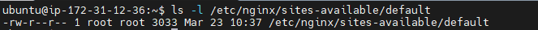
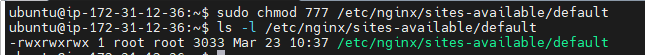

# INC-009 — File Permission Risk (chmod 777 / 600)

## Summary

nginx 설정 파일(`/etc/nginx/sites-available/default`)에 `chmod 777` 및 `chmod 600`을
적용하여 권한 과다 부여와 권한 과소 부여 상태를 각각 재현했다. `stat` 명령으로 권한 숫자를
확인하고 주요 운영 파일 4개의 권한을 일괄 점검했다. 이후 표준 권한(`644`)으로 복구했다.

## Severity

Medium

## Impact

- **chmod 777**: root 권한 없는 일반 사용자도 nginx 설정 파일을 수정할 수 있는 상태가 됨.
  악의적인 사용자 또는 침해된 계정이 설정을 변조하여 서비스 중단 악성 proxy 삽입 등의
  공격이 가능해짐
- **chmod 600**: nginx master process(root)는 읽을 수 있어 서비스 장애는 발생하지 않았으나
  모니터링 에이전트 등 root 권한이 없는 도구가 설정 파일을 읽지 못하는 상태가 됨
- nginx 서비스 자체는 동작하지만 운영 보안 기준을 위반한 상태

## Detection
```bash
ls -l /etc/nginx/sites-available/default
stat /etc/nginx/sites-available/default
```

- 정상: `-rw-r--r--` (644), Uid: root
- 위험(과다): `-rwxrwxrwx` (777)
- 위험(과소): `-rw-------` (600)

## Timeline

| 순서 | 행동 |
|------|------|
| 1 | `ls -l` 로 현재 권한 확인 → 644 정상 상태 확인 |
| 2 | `chmod 777` 적용 → 권한 과다 부여 상태 재현 |
| 3 | `ls -l` 로 777 상태 확인 |
| 4 | `chmod 644` 로 1차 복구 |
| 5 | `stat` 명령으로 숫자 권한(0644) 및 메타데이터 확인 |
| 6 | 주요 파일 4개 권한 일괄 점검 |
| 7 | `chmod 600` 적용 → 권한 과소 부여 상태 재현 |
| 8 | `systemctl reload nginx` 후 `curl -I http://localhost` → 200 OK 확인 |
| 9 | `ps aux | grep nginx` 로 master(root)/worker(www-data) 구조 확인 |
| 10 | `chmod 644` 로 최종 복구 |

## Symptoms

- `ls -l` 결과에서 `-rwxrwxrwx` (777) 또는 `-rw-------` (600) 표시
- 777 상태: nginx 서비스 정상 동작하나 파일 보안 기준 위반
- 600 상태: nginx reload 후에도 서비스 정상 동작 (master process가 root이기 때문)

## Root Cause

리눅스 파일 권한은 `owner / group / other` 세 계층으로 구성된다.

- `chmod 777`은 other(아무나)에게 쓰기/실행 권한을 부여하여 임의 수정 위험을 만든다.
- `chmod 600`은 owner(root)만 읽을 수 있어 root 권한이 없는 프로세스나 도구가
  파일에 접근하지 못한다.

nginx는 master process(root)가 설정 파일을 읽고 worker process(www-data)가
실제 요청을 처리하는 구조이므로 600 상태에서도 reload가 성공했다.
그러나 644가 아닌 권한은 운영 보안 기준을 벗어난 상태이며 잠재적 위험을 내포한다.

설정 파일의 표준 권한:

| 파일 | 표준 권한 | 이유 |
|------|-----------|------|
| `/etc/nginx/nginx.conf` | 644 | root만 수정, 누구나 읽기 가능 |
| `/etc/nginx/sites-available/default` | 644 | root만 수정, 누구나 읽기 가능 |
| `/etc/ssh/sshd_config` | 644 | root만 수정, 누구나 읽기 가능 |
| `~/.ssh/authorized_keys` | 600 | 소유자만 읽기, 타인 읽기 시 SSH가 키 인증 거부 |

## Recovery
```bash
sudo chmod 644 /etc/nginx/sites-available/default
```

복구 후 검증:
```bash
ls -l /etc/nginx/sites-available/default
stat /etc/nginx/sites-available/default
```

기대 결과: `-rw-r--r-- 1 root root`, `Access: (0644/-rw-r--r--)`

## Prevention

- 설정 파일 권한은 정기적으로 점검한다 (`ls -l` 또는 `security-baseline.sh`)
- nginx 설정 파일의 표준 권한은 `644`, 소유자는 `root:root`로 유지한다
- `authorized_keys`는 반드시 `600`으로 유지한다 (SSH 데몬 동작 조건)
- 권한 변경 시 변경 전/후를 반드시 `stat` 으로 기록한다
- `stat` 의 Change 타임스탬프로 권한 변경 이력을 추적할 수 있다

## Evidence

- `evidence/day17-permission-777.png` — chmod 777 적용 후 상태


- `evidence/day17-permission-fixed.png` — chmod 644 복구 후 상태

